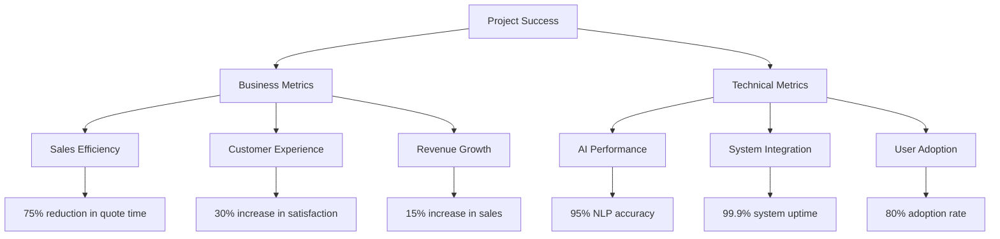
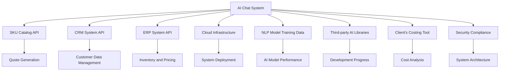
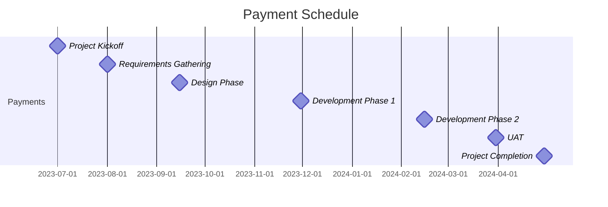
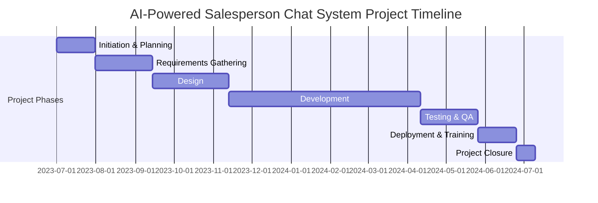
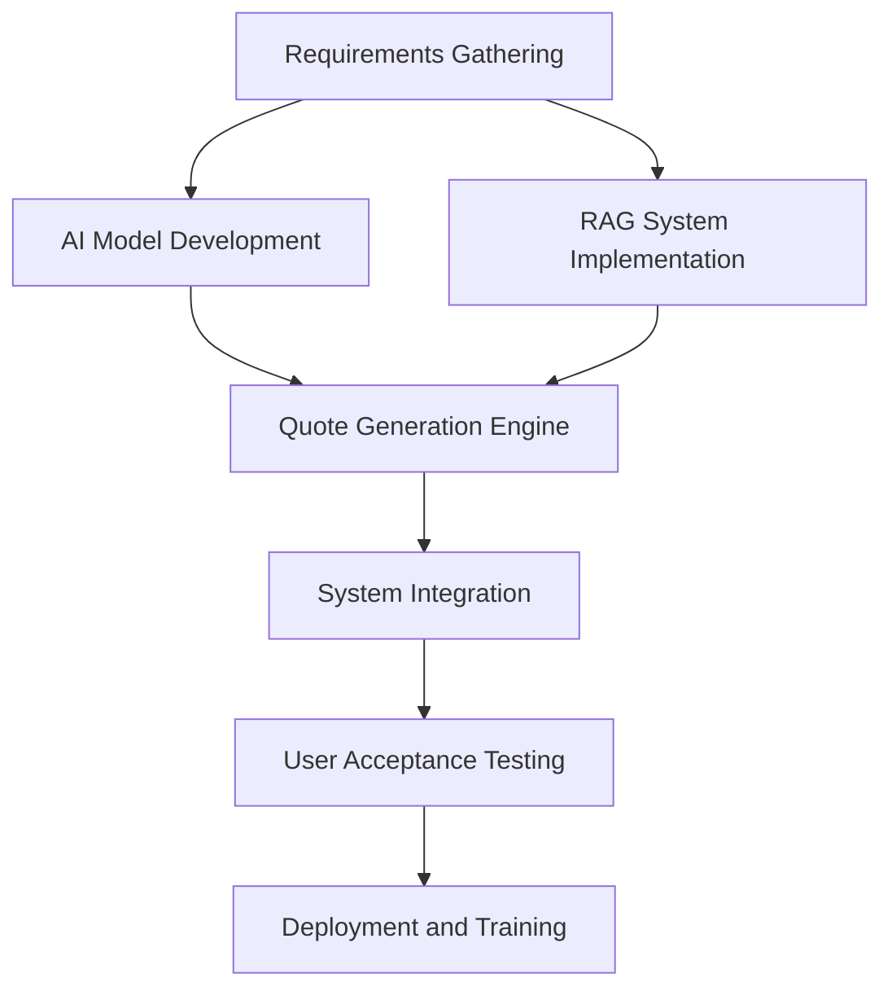
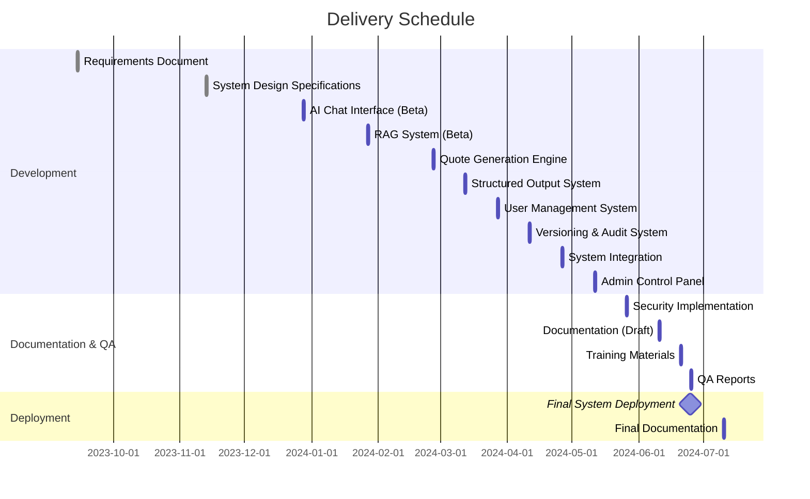

## EXECUTIVE SUMMARY

### PROJECT OVERVIEW

This project aims to develop an AI-powered salesperson chat system for streamlining part quoting and ordering processes. The client faces challenges in efficiently handling customer inquiries, retrieving relevant product information, and generating accurate quotes. Our proposed solution leverages cutting-edge AI technology to address these pain points by offering a natural language interface for requirement ingestion, intelligent data retrieval using Retrieval-Augmented Generation (RAG), and automated quote generation integrated with the company's SKU catalog.

### OBJECTIVES

1. Enhance customer experience by providing an intuitive, conversational interface for part inquiries and quotes
2. Reduce response time for quote generation by automating the process of requirement gathering and data retrieval
3. Improve quote accuracy by leveraging AI to extract precise information from various data sources
4. Increase sales efficiency by enabling both sales representatives and customers to interact directly with the system
5. Streamline internal processes by integrating with existing systems (CRM, ERP) and maintaining audit trails

### VALUE PROPOSITION

Our agency offers a unique combination of expertise and innovation that sets us apart for this project:

1. **AI-Driven Solution**: We specialize in developing advanced AI systems, ensuring a state-of-the-art chat interface that can understand and process complex part requirements.

2. **RAG Technology Integration**: Our proficiency in Retrieval-Augmented Generation allows for intelligent and context-aware data retrieval, significantly enhancing the accuracy and relevance of generated quotes.

3. **Seamless System Integration**: We have a proven track record of integrating AI solutions with existing business systems, ensuring smooth data flow between the new chat system and the client's SKU catalog, CRM, and ERP.

4. **Customization and Scalability**: Our solution is designed to be highly customizable, allowing for easy adaptation to the client's specific needs and future scaling as the business grows.

5. **Data Security and Compliance**: We prioritize data protection and regulatory compliance, implementing robust security measures and maintaining detailed audit trails.

By choosing our agency, the client will benefit from a cutting-edge AI solution that not only addresses their immediate needs but also positions them at the forefront of technological innovation in their industry.

## PROJECT OBJECTIVES

### BUSINESS GOALS

1. Increase Sales Efficiency:
   - Reduce quote generation time by 75% through AI-powered automation
   - Enable sales representatives to handle 50% more inquiries per day
   - Decrease the average time-to-quote from 48 hours to 2 hours

2. Enhance Customer Experience:
   - Provide 24/7 availability for part inquiries and quote requests
   - Improve customer satisfaction scores by 30% through faster response times
   - Reduce customer churn rate by 15% due to improved service quality

3. Optimize Resource Allocation:
   - Decrease manual data entry and research time by 80%
   - Reallocate 40% of sales team's time from quote generation to high-value customer interactions
   - Reduce training time for new sales staff by 50% through standardized AI-assisted quoting

4. Increase Revenue:
   - Boost conversion rate of quotes to orders by 25%
   - Increase average order value by 15% through intelligent up-selling and cross-selling
   - Expand market reach by enabling self-service quoting for small to medium-sized customers

### TECHNICAL GOALS

1. AI-Powered Natural Language Processing:
   - Implement an NLP engine capable of understanding and processing complex part requirements with 95% accuracy
   - Develop an interactive prompting system to guide users through the quoting process

2. Retrieval-Augmented Generation (RAG) Integration:
   - Create a RAG system that can access and analyze internal data sources with 99.9% uptime
   - Achieve a 90% relevance rate for retrieved information used in quote generation

3. SKU Catalog Integration:
   - Develop a real-time integration with the company's SKU catalog, ensuring 100% accuracy in pricing and product information
   - Implement a dynamic pricing engine capable of handling complex pricing rules and bulk order discounts

4. System Interoperability:
   - Integrate the AI chat system with existing CRM and ERP systems, ensuring bi-directional data flow
   - Develop APIs for seamless communication between the chat system and other internal tools (e.g., costing tool, inventory management)

5. User Interface and Experience:
   - Create an intuitive chat interface accessible via web and mobile platforms
   - Achieve a system response time of less than 2 seconds for 95% of user interactions

6. Data Security and Compliance:
   - Implement end-to-end encryption for all data transmissions
   - Develop a comprehensive audit trail system for quote versioning and change tracking

### SUCCESS CRITERIA

| Metric | Target | Measurement Method |
|--------|--------|---------------------|
| Quote Generation Time | 75% reduction | Compare average time before and after system implementation |
| Customer Satisfaction Score | 30% increase | Conduct pre- and post-implementation surveys |
| Sales Team Productivity | 50% increase in inquiries handled | Track number of inquiries processed per sales rep |
| Quote Accuracy | 98% or higher | Compare AI-generated quotes with manually verified quotes |
| System Uptime | 99.9% | Monitor system availability over time |
| User Adoption Rate | 80% of sales team within 3 months | Track system usage statistics |
| Revenue Impact | 15% increase in overall sales | Compare quarterly sales figures pre- and post-implementation |
| ROI | 200% within 18 months | Calculate based on cost savings and revenue increase |

## SCOPE OF WORK

### IN-SCOPE

1. AI-Powered Chat Interface
   - Natural language processing for part requirement ingestion
   - Interactive prompting system for gathering missing information
   - Support for both text and file input (e.g., drawings, specifications)

2. Retrieval-Augmented Generation (RAG) System
   - Integration with internal data sources (ERP, CRM, previous quotes, product specs)
   - Customizable data source prioritization
   - Dimension extraction from drawings and specifications

3. Quote Generation Engine
   - SKU catalog integration for accurate pricing and product mapping
   - Dynamic pricing engine with support for bulk order discounts
   - Integration with existing costing tool for accurate cost analysis
   - Multi-part quote consolidation

4. Structured Output System
   - Formatted quote generation with all required details
   - Export options (PDF, CSV, email)
   - CRM integration for automatic quote logging

5. User Management and Access Control
   - Role-based access for sales representatives and customers
   - User authentication and authorization system

6. Versioning and Audit Trail
   - Quote versioning system
   - Comprehensive audit logging for compliance and tracking

7. System Integration
   - API development for integration with existing CRM and ERP systems
   - Real-time synchronization with SKU catalog

8. User Interface Development
   - Web-based interface for desktop access
   - Mobile-responsive design for on-the-go use

9. Admin Controls and Customization
   - Rule configuration for quote generation and approval workflows
   - Customizable filters for SKU mapping

10. Security Implementation
    - End-to-end encryption for data transmission
    - Compliance with industry-standard security protocols

11. Training and Documentation
    - User manuals for sales representatives and administrators
    - Video tutorials for system usage
    - Knowledge base for common issues and FAQs

### OUT-OF-SCOPE

1. Hardware procurement or setup for client infrastructure
2. Modifications to existing CRM or ERP systems beyond API integration
3. Custom mobile applications (native iOS or Android apps)
4. On-premise deployment (system will be cloud-based)
5. Integration with third-party e-commerce platforms
6. Multilingual support (initial deployment will be in English only)
7. Automated order placement or payment processing
8. Customer support chatbot functionality unrelated to part quoting
9. Machine learning model training for new product categories post-deployment

### ASSUMPTIONS

1. Client will provide access to necessary internal systems (CRM, ERP, SKU catalog) for integration
2. Existing data sources are well-structured and maintained regularly
3. Client has necessary licenses for third-party software used in the project
4. Client will assign a dedicated project manager as a point of contact
5. Sales team members will be available for user acceptance testing
6. Client's IT infrastructure can support cloud-based solution deployment
7. Necessary approvals for AI implementation in sales processes have been obtained
8. Client will provide sample data for initial system training and testing

### DEPENDENCIES

| Dependency | Description | Impact |
|------------|-------------|--------|
| SKU Catalog API | Access to up-to-date product information | Critical for accurate quote generation |
| CRM System API | Integration for customer data and quote logging | High impact on user adoption and workflow |
| ERP System API | Access to inventory and pricing data | Essential for real-time quote accuracy |
| Cloud Infrastructure | Deployment environment for the AI system | Necessary for system operation |
| NLP Model Training Data | High-quality data for AI model training | Affects accuracy of requirement interpretation |
| Third-party AI Libraries | Latest versions of required AI frameworks | May impact development timeline if updates are needed |
| Client's Costing Tool | Integration for accurate cost analysis | Important for pricing strategy and profitability |
| Security Compliance | Client's security protocols and industry standards | May affect system architecture and deployment |

## BUDGET AND COST ESTIMATES

### COST BREAKDOWN

The following table provides a detailed breakdown of the project costs:

| Category | Item | Cost (USD) |
|----------|------|------------|
| Labor | Project Manager (800 hours @ $150/hr) | 120,000 |
| Labor | Senior AI Engineer (1200 hours @ $200/hr) | 240,000 |
| Labor | Full-Stack Developer (1000 hours @ $120/hr) | 120,000 |
| Labor | UI/UX Designer (400 hours @ $100/hr) | 40,000 |
| Labor | QA Specialist (600 hours @ $90/hr) | 54,000 |
| Software | AI Development Frameworks and Libraries | 25,000 |
| Software | Cloud Infrastructure (12 months) | 36,000 |
| Software | Third-party API Integrations | 15,000 |
| Hardware | Development and Testing Equipment | 10,000 |
| Miscellaneous | Training and Documentation | 20,000 |
| Miscellaneous | Travel and On-site Meetings | 15,000 |
| Contingency | 10% of Total Project Cost | 69,500 |
| **Total** |  | **764,500** |

### PAYMENT SCHEDULE

The proposed payment schedule is tied to project milestones and deliverables:

| Milestone | Deliverable | Payment (% of Total) | Amount (USD) |
|-----------|-------------|----------------------|--------------|
| Project Kickoff | Signed Contract | 20% | 152,900 |
| Requirements Gathering | Approved Requirements Document | 10% | 76,450 |
| Design Phase Completion | Approved Design Specifications | 15% | 114,675 |
| Development Phase 1 | AI Chat Interface and RAG System | 20% | 152,900 |
| Development Phase 2 | Quote Generation Engine and Integrations | 20% | 152,900 |
| User Acceptance Testing | Successful UAT Sign-off | 10% | 76,450 |
| Project Completion | System Deployment and Documentation | 5% | 38,225 |

### BUDGET CONSIDERATIONS

1. **Scope Creep**: 
   - Risk: Additional features or changes in requirements may increase development time and costs.
   - Mitigation: Implement a strict change control process with clear documentation and approval procedures for any scope changes.

2. **Integration Complexity**:
   - Risk: Unforeseen challenges in integrating with existing systems (CRM, ERP, SKU catalog) may require additional development time.
   - Mitigation: Conduct thorough system analysis during the requirements phase and allocate buffer time for integration tasks.

3. **AI Model Performance**:
   - Risk: The AI model may require additional training or fine-tuning to achieve desired accuracy levels.
   - Mitigation: Plan for iterative model improvements and include a contingency budget for extended AI development if needed.

4. **Data Quality and Availability**:
   - Risk: Poor quality or insufficient training data may impact AI performance and project timeline.
   - Mitigation: Early assessment of available data and provision for data cleaning and augmentation tasks in the project plan.

5. **Regulatory Compliance**:
   - Risk: Changes in data protection regulations or industry standards may require additional security measures.
   - Mitigation: Regular compliance checks and allocation of resources for potential security enhancements.

6. **Third-party Dependencies**:
   - Risk: Updates or changes to third-party APIs or libraries may impact development or system performance.
   - Mitigation: Thorough evaluation of third-party components and inclusion of contingency time for potential updates or replacements.

7. **Cloud Infrastructure Costs**:
   - Risk: Actual usage may exceed initial estimates, leading to higher operational costs.
   - Mitigation: Implement cloud cost monitoring tools and optimize resource allocation based on actual usage patterns.

8. **Exchange Rate Fluctuations**:
   - Risk: For international clients, currency fluctuations may impact the project budget.
   - Mitigation: Consider using forward contracts or including a currency adjustment clause in the contract.

To manage these budget considerations effectively, we propose:

1. Monthly budget reviews with the client to track expenses against projections.
2. A change control board to evaluate and approve any scope changes that may impact the budget.
3. Regular risk assessments to identify and address potential budget impacts proactively.
4. Maintaining a detailed contingency fund allocation plan to address unforeseen challenges without disrupting the overall project timeline.

## TIMELINE AND MILESTONES

### PROJECT TIMELINE

The project is estimated to span approximately 12 months, divided into the following major phases:

### KEY MILESTONES

| Milestone | Description | Target Date |
|-----------|-------------|-------------|
| M1: Project Kickoff | Contract signed, team assembled | 2023-07-01 |
| M2: Requirements Approval | Detailed requirements document signed off | 2023-09-14 |
| M3: Design Completion | System architecture and UI/UX designs approved | 2023-11-13 |
| M4: AI Model v1.0 | First version of NLP model ready for integration | 2023-12-28 |
| M5: RAG System Integration | RAG system integrated with internal data sources | 2024-01-27 |
| M6: Quote Generation Engine | Core quote generation functionality completed | 2024-02-26 |
| M7: System Integration | All system components integrated (CRM, ERP, SKU catalog) | 2024-03-27 |
| M8: User Acceptance Testing | UAT completed and sign-off received | 2024-05-26 |
| M9: Go-Live | System deployed to production environment | 2024-06-25 |
| M10: Project Closure | Final documentation delivered, project retrospective completed | 2024-07-10 |

### CRITICAL PATH

The following tasks and activities are identified as critical to keeping the project on schedule:

1. Requirements Gathering and Approval
   - Detailed analysis of existing systems (CRM, ERP, SKU catalog)
   - Stakeholder interviews and requirement validation

2. AI Model Development
   - Data collection and preparation for NLP model training
   - Iterative model development and performance tuning

3. RAG System Implementation
   - Integration with internal data sources
   - Performance optimization for real-time data retrieval

4. Quote Generation Engine Development
   - SKU catalog integration
   - Dynamic pricing rules implementation

5. System Integration
   - API development for CRM and ERP integration
   - End-to-end system testing

6. User Acceptance Testing
   - Test case development
   - Bug fixing and performance optimization

7. Deployment and Training
   - Production environment setup
   - User training and documentation

To ensure the project stays on track, special attention will be given to these critical path items:

- Regular progress reviews and risk assessments
- Early identification and mitigation of potential bottlenecks
- Allocation of additional resources if needed to prevent delays
- Continuous communication with stakeholders to manage expectations and address issues promptly

By closely monitoring these critical path activities and maintaining flexibility in resource allocation, we aim to deliver the project on time and within scope.

## DELIVERABLES

### LIST OF DELIVERABLES

1. AI-Powered Chat Interface
   - Web-based chat application
   - Mobile-responsive design
   - Natural language processing engine
   - Interactive prompting system

2. Retrieval-Augmented Generation (RAG) System
   - Data integration module
   - Customizable data source prioritization interface
   - Dimension extraction tool for drawings and specifications

3. Quote Generation Engine
   - SKU catalog integration module
   - Dynamic pricing engine
   - Costing tool integration
   - Multi-part quote consolidation feature

4. Structured Output System
   - Quote formatting module
   - PDF and CSV export functionality
   - Email integration for quote delivery

5. User Management and Access Control System
   - Role-based access control module
   - User authentication and authorization system

6. Versioning and Audit Trail System
   - Quote versioning module
   - Comprehensive audit logging system

7. System Integration Components
   - CRM integration API
   - ERP integration API
   - SKU catalog synchronization module

8. Admin Control Panel
   - Rule configuration interface for quote generation
   - Approval workflow management system
   - Customizable filters for SKU mapping

9. Security Implementation
   - End-to-end encryption module
   - Security compliance documentation

10. Documentation
    - User manuals for sales representatives
    - Administrator guide
    - API documentation
    - System architecture documentation

11. Training Materials
    - Video tutorials for system usage
    - Interactive e-learning modules
    - Knowledge base for common issues and FAQs

12. Quality Assurance Deliverables
    - Test plans and test cases
    - QA reports and bug tracking documentation

### DELIVERY SCHEDULE

| Deliverable | Expected Delivery Date |
|-------------|------------------------|
| Requirements Document | 2023-09-14 |
| System Design Specifications | 2023-11-13 |
| AI-Powered Chat Interface (Beta) | 2023-12-28 |
| RAG System (Beta) | 2024-01-27 |
| Quote Generation Engine (Beta) | 2024-02-26 |
| Structured Output System | 2024-03-12 |
| User Management and Access Control System | 2024-03-27 |
| Versioning and Audit Trail System | 2024-04-11 |
| System Integration Components | 2024-04-26 |
| Admin Control Panel | 2024-05-11 |
| Security Implementation | 2024-05-26 |
| Documentation (Draft) | 2024-06-10 |
| Training Materials | 2024-06-20 |
| Quality Assurance Reports | 2024-06-25 |
| Final System Deployment | 2024-06-25 |
| Final Documentation | 2024-07-10 |

### ACCEPTANCE CRITERIA

1. AI-Powered Chat Interface
   - Successfully processes 95% of natural language inputs without errors
   - Responds to user queries within 2 seconds
   - Accurately identifies and prompts for missing information in 90% of cases

2. Retrieval-Augmented Generation (RAG) System
   - Retrieves relevant information from internal data sources with 90% accuracy
   - Processes and integrates data from multiple sources within 5 seconds
   - Correctly extracts dimensions from drawings with 98% accuracy

3. Quote Generation Engine
   - Generates quotes with 99.9% pricing accuracy compared to manual quotes
   - Handles multi-part quotes with up to 100 line items without performance degradation
   - Applies correct bulk order discounts in 100% of cases

4. Structured Output System
   - Produces correctly formatted PDF and CSV exports in 100% of attempts
   - Successfully emails quotes to specified recipients in 99.9% of cases
   - Includes all required quote details as specified in the requirements document

5. User Management and Access Control System
   - Correctly applies role-based access restrictions in 100% of cases
   - Authenticates users with an average response time of less than 1 second
   - Maintains user session security with zero reported breaches

6. Versioning and Audit Trail System
   - Captures 100% of quote revisions and changes
   - Provides a complete audit trail for any quote within 3 seconds of request
   - Maintains data integrity with zero instances of lost or corrupted audit data

7. System Integration Components
   - Achieves bi-directional data synchronization with CRM and ERP systems with 99.9% accuracy
   - Updates SKU catalog information in real-time with zero discrepancies

8. Admin Control Panel
   - Allows administrators to modify all configurable settings without developer intervention
   - Implements custom rules and filters with 100% accuracy

9. Security Implementation
   - Passes all required security audits and penetration tests
   - Maintains end-to-end encryption for all data transmissions
   - Complies with all specified data protection regulations

10. Documentation
    - Covers all system features and functions comprehensively
    - Receives approval from client's technical team for accuracy and completeness

11. Training Materials
    - Achieves a minimum of 90% pass rate in user competency tests after training
    - Receives an average satisfaction rating of 4 out of 5 from trainees

12. Quality Assurance Deliverables
    - System passes 100% of critical test cases
    - All high-priority bugs resolved before final deployment
    - Achieves 99.9% uptime during stress testing

Each deliverable will be subject to a formal review and approval process by the client's designated project stakeholders. Acceptance will be confirmed in writing once all criteria have been met satisfactorily.