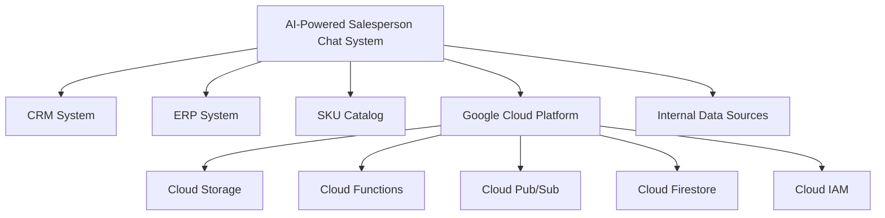
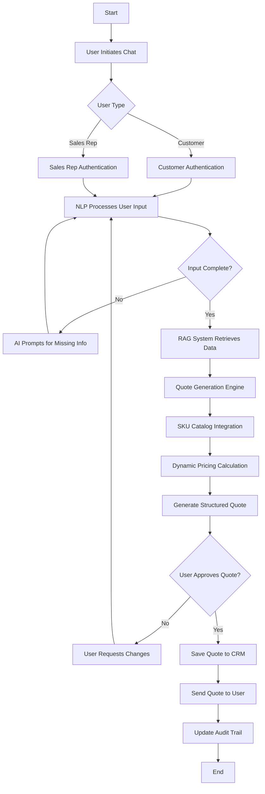
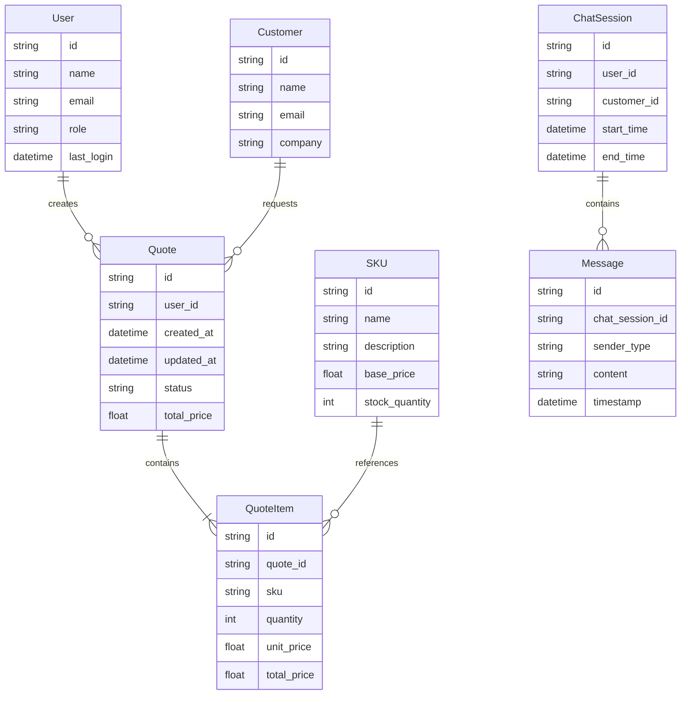
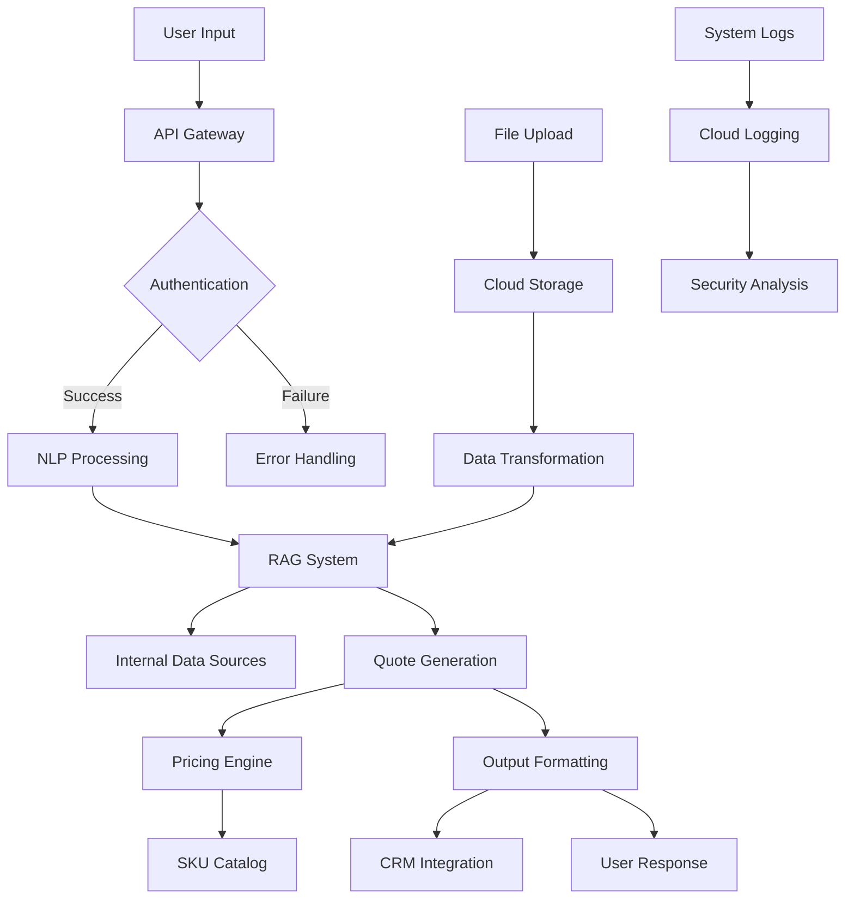

## INTRODUCTION

### PURPOSE

The purpose of this Software Requirements Specification (SRS) document is to provide a comprehensive and detailed description of the AI-powered salesperson chat system for part quoting and ordering processes. This document serves as the primary reference for all stakeholders involved in the development, implementation, and maintenance of the system. It is intended for the following audience:

1. Development Team: To understand the technical requirements and functionalities to be implemented.
2. Project Managers: To plan and track the project's progress against defined requirements.
3. Quality Assurance Team: To develop test plans and ensure the system meets specified requirements.
4. Client Stakeholders: To review and approve the proposed system features and functionalities.
5. System Administrators: To understand the system's architecture and integration points for future maintenance.
6. End Users (Sales Representatives and Customers): To gain insight into the system's capabilities and expected user experience.

This SRS will serve as the foundation for the entire development process, ensuring all parties have a clear and consistent understanding of the project's objectives and deliverables.

### SCOPE

The AI-powered salesperson chat system is a cutting-edge solution designed to revolutionize the part quoting and ordering processes for our client. The system aims to streamline customer interactions, automate data retrieval, and generate accurate quotes with minimal human intervention. The core functionalities and goals of the system include:

1. Natural Language Interface:
   - Implement an AI-powered chat interface using React and Tailwind CSS for the frontend.
   - Develop a robust Natural Language Processing (NLP) engine using Python to interpret user queries and part requirements.

2. Retrieval-Augmented Generation (RAG):
   - Create a Python-based RAG system to intelligently retrieve and analyze data from internal sources.
   - Integrate with Google Cloud Storage for efficient data management and retrieval.

3. Quote Generation:
   - Develop a dynamic quote generation engine that integrates with the client's SKU catalog.
   - Implement real-time pricing calculations and bulk order discounts.

4. System Integration:
   - Create APIs using Python and Google Cloud Functions to integrate with existing CRM and ERP systems.
   - Implement real-time synchronization with the SKU catalog using Google Cloud Pub/Sub.

5. User Management and Security:
   - Develop a role-based access control system using Google Cloud Identity and Access Management (IAM).
   - Implement end-to-end encryption and comply with data protection regulations.

6. Versioning and Audit Trail:
   - Create a comprehensive versioning system for quotes using Google Cloud Firestore.
   - Implement an audit logging system to track all user actions and system changes.

7. Admin Controls and Customization:
   - Develop an admin panel using React and Tailwind CSS for system configuration and rule management.
   - Implement customizable filters for SKU mapping and quote generation rules.

The system aims to provide the following benefits:

1. Increased sales efficiency by reducing quote generation time by 75%.
2. Enhanced customer experience through 24/7 availability and faster response times.
3. Improved quote accuracy by leveraging AI and real-time data integration.
4. Streamlined internal processes through automation and integration with existing systems.
5. Scalable solution that can adapt to growing business needs and changing market conditions.

By implementing this AI-powered system, the client will position themselves at the forefront of technological innovation in their industry, gaining a significant competitive advantage in customer service and operational efficiency.

## PRODUCT DESCRIPTION

### PRODUCT PERSPECTIVE

The AI-powered salesperson chat system is a comprehensive solution designed to revolutionize the part quoting and ordering processes within the client's existing business ecosystem. It integrates seamlessly with the following components:

1. Customer Relationship Management (CRM) System: The chat system will interface with the client's existing CRM to access customer data, update interaction history, and log generated quotes.

2. Enterprise Resource Planning (ERP) System: Integration with the ERP system will provide real-time access to inventory levels, pricing information, and order processing capabilities.

3. SKU Catalog: The system will maintain a real-time connection with the company's SKU catalog to ensure accurate product information and pricing during quote generation.

4. Google Cloud Platform (GCP): The solution will be built on and leverage various GCP services for scalability, reliability, and advanced AI capabilities.

5. Internal Data Sources: The Retrieval-Augmented Generation (RAG) system will access and analyze various internal data sources such as past quotes, product specifications, and design drawings.



### PRODUCT FUNCTIONS

The AI-powered salesperson chat system will perform the following main functions:

1. Natural Language Processing (NLP):
   - Interpret user queries and part requirements using advanced NLP techniques
   - Engage in interactive conversations to gather missing information

2. Data Retrieval and Analysis:
   - Utilize RAG to intelligently retrieve and analyze data from internal sources
   - Extract dimensions and specifications from uploaded drawings or documents

3. Quote Generation:
   - Generate accurate quotes based on retrieved data and SKU catalog information
   - Apply dynamic pricing rules, including bulk order discounts
   - Consolidate multi-part quotes into a single, structured output

4. User Management:
   - Provide role-based access for sales representatives and customers
   - Authenticate and authorize users securely

5. System Integration:
   - Synchronize data with CRM and ERP systems in real-time
   - Update and retrieve information from the SKU catalog

6. Versioning and Auditing:
   - Maintain version history for all generated quotes
   - Provide a comprehensive audit trail for compliance and tracking

7. Administrative Controls:
   - Allow system administrators to configure rules and workflows
   - Provide customizable filters for SKU mapping and quote generation

8. Reporting and Analytics:
   - Generate insights on quoting patterns, customer interactions, and system performance
   - Provide dashboards for monitoring key performance indicators

### USER CHARACTERISTICS

The system is designed to cater to three primary user groups:

1. Sales Representatives:
   - Expertise Level: Intermediate to Advanced
   - Characteristics: Familiar with the company's products, pricing strategies, and customer base
   - Needs: Efficient quote generation, access to customer history, ability to customize quotes

2. Customers:
   - Expertise Level: Novice to Intermediate
   - Characteristics: Varied technical knowledge, may have limited understanding of product specifications
   - Needs: Easy-to-use interface, clear explanations, quick and accurate quotes

3. System Administrators:
   - Expertise Level: Advanced
   - Characteristics: Technical background, understanding of business processes and data structures
   - Needs: Powerful configuration tools, access to system logs, ability to manage user roles

User Personas:

1. Sarah, Sales Representative:
   - 35 years old, 8 years of experience in technical sales
   - Comfortable with technology but values efficiency
   - Needs to generate quotes quickly while on customer calls or site visits

2. Mark, Customer:
   - 42 years old, Procurement Manager at a manufacturing company
   - Basic technical knowledge but not an expert in all product areas
   - Requires self-service quoting for routine orders and assistance for complex requirements

3. Alex, System Administrator:
   - 29 years old, IT specialist with a background in data management
   - Highly technical, responsible for maintaining system integrity and performance
   - Needs to configure system rules, manage integrations, and troubleshoot issues

### CONSTRAINTS

1. Technical Constraints:
   - The system must be cloud-based and deployed on Google Cloud Platform
   - Frontend development limited to React and Tailwind CSS
   - Backend services must be developed primarily in Python
   - Must integrate with existing CRM and ERP systems without major modifications to those systems

2. Regulatory Constraints:
   - Compliance with GDPR and other applicable data protection regulations
   - Adherence to industry-specific standards for quote generation and pricing

3. Performance Constraints:
   - System must handle up to 1000 concurrent users without degradation in performance
   - Quote generation must complete within 5 seconds for 95% of requests
   - API response times should not exceed 200ms for 99% of calls

4. Security Constraints:
   - Implementation of end-to-end encryption for all data transmissions
   - Strict adherence to OAuth 2.0 for authentication and authorization
   - Regular security audits and penetration testing required

5. Usability Constraints:
   - User interface must be accessible and comply with WCAG 2.1 Level AA standards
   - System must support multiple languages (initially English, with framework for adding others)

6. Budgetary Constraints:
   - Development and first-year operational costs must not exceed the approved budget of $764,500
   - Ongoing operational costs must be optimized for cloud resource usage

### ASSUMPTIONS AND DEPENDENCIES

Assumptions:

1. The client's existing CRM and ERP systems have well-documented APIs for integration
2. The SKU catalog data is well-structured and maintained regularly
3. Internal data sources (past quotes, product specs) are digitized and accessible
4. The client's team will provide subject matter expertise during the development process
5. Users have access to modern web browsers and stable internet connections
6. The client has necessary licenses for all third-party software used in the project

Dependencies:

1. Google Cloud Platform Services:
   - Availability and performance of GCP services, including Cloud Functions, Cloud Storage, and Cloud Pub/Sub
   - Continued support for current APIs and services throughout the project lifecycle

2. Third-Party Libraries and Frameworks:
   - Stability and security of React, Tailwind CSS, and key Python libraries
   - Timely updates and bug fixes from the open-source community

3. AI and Machine Learning Models:
   - Availability of suitable pre-trained models for NLP tasks
   - Access to sufficient training data for fine-tuning models to the client's domain

4. External Systems:
   - Reliability and uptime of the client's CRM and ERP systems
   - Timely updates to the SKU catalog and pricing information

5. Regulatory Compliance:
   - Stability of current data protection regulations
   - Timely notification of any changes in industry-specific standards

6. Client Resources:
   - Availability of client stakeholders for regular meetings and decision-making
   - Timely provision of necessary data, documentation, and access to internal systems

7. Network Infrastructure:
   - Adequate network capacity and reliability at the client's locations
   - Stable internet connectivity for cloud service interactions

By carefully managing these assumptions and dependencies, we aim to mitigate risks and ensure the successful development and deployment of the AI-powered salesperson chat system.

## PROCESS FLOWCHART

The following flowchart illustrates the high-level process flow of the AI-powered salesperson chat system for part quoting and ordering:



This flowchart outlines the main steps in the quoting process:

1. The process begins when a user (customer or sales representative) initiates a chat session.
2. The system authenticates the user based on their role.
3. Natural Language Processing (NLP) interprets the user's input.
4. If the input is incomplete, the AI prompts for additional information.
5. Once the input is complete, the Retrieval-Augmented Generation (RAG) system retrieves relevant data.
6. The Quote Generation Engine processes the information.
7. The system integrates with the SKU catalog and calculates dynamic pricing.
8. A structured quote is generated and presented to the user.
9. If the user requests changes, the process loops back to the input stage.
10. Upon approval, the quote is saved to the CRM, sent to the user, and the audit trail is updated.

This process ensures a seamless, AI-driven experience for both customers and sales representatives, leveraging the power of NLP, RAG, and integration with existing systems to provide accurate and efficient quoting.

Here's a breakdown of the product features with the requested sub-sections:

1. AI-Powered Chat Interface

ID: F001
DESCRIPTION: A web-based chat interface that uses natural language processing to interpret user queries and guide them through the quoting process.
PRIORITY: High

| Functional Requirement | Description |
|------------------------|-------------|
| F001-1 | Implement a React-based chat UI with Tailwind CSS styling |
| F001-2 | Develop a Python backend for NLP processing using Google Cloud Natural Language API |
| F001-3 | Create an interactive prompting system to gather missing information |
| F001-4 | Support text and file input (e.g., drawings, specifications) |
| F001-5 | Ensure mobile responsiveness for on-the-go use |

2. Retrieval-Augmented Generation (RAG) System

ID: F002
DESCRIPTION: A system that leverages RAG to pull relevant data from internal company files and data sources to assist in quote generation.
PRIORITY: High

| Functional Requirement | Description |
|------------------------|-------------|
| F002-1 | Develop a Python-based RAG system using Google Cloud AI Platform |
| F002-2 | Integrate with internal data sources (ERP, CRM, previous quotes, product specs) |
| F002-3 | Implement customizable data source prioritization |
| F002-4 | Create a dimension extraction tool for analyzing drawings and specifications |
| F002-5 | Optimize for real-time data retrieval and processing |

3. Quote Generation Engine

ID: F003
DESCRIPTION: An engine that generates accurate quotes based on user requirements, SKU catalog, and dynamic pricing rules.
PRIORITY: High

| Functional Requirement | Description |
|------------------------|-------------|
| F003-1 | Develop a Python-based quote generation engine |
| F003-2 | Integrate with the company's SKU catalog for accurate product mapping |
| F003-3 | Implement dynamic pricing with support for bulk order discounts |
| F003-4 | Create an integration module for the existing costing tool |
| F003-5 | Develop a multi-part quote consolidation feature |

4. Structured Output System

ID: F004
DESCRIPTION: A system that formats and delivers quotes in various structured formats.
PRIORITY: Medium

| Functional Requirement | Description |
|------------------------|-------------|
| F004-1 | Create a quote formatting module using Python |
| F004-2 | Implement PDF export functionality using a library like ReportLab |
| F004-3 | Develop CSV export capability for easy data manipulation |
| F004-4 | Integrate with Google Cloud Storage for file management |
| F004-5 | Implement email delivery using Google Cloud Functions and SendGrid |

5. User Management and Access Control

ID: F005
DESCRIPTION: A system to manage user roles, authentication, and authorization for both sales representatives and customers.
PRIORITY: High

| Functional Requirement | Description |
|------------------------|-------------|
| F005-1 | Implement user authentication using Google Cloud Identity Platform |
| F005-2 | Develop role-based access control using Google Cloud IAM |
| F005-3 | Create a user profile management interface using React and Tailwind CSS |
| F005-4 | Implement secure session management |
| F005-5 | Develop an API for user data CRUD operations using Python and Flask |

6. Versioning and Audit Trail System

ID: F006
DESCRIPTION: A system to track quote revisions and maintain a comprehensive audit trail for compliance and tracking.
PRIORITY: Medium

| Functional Requirement | Description |
|------------------------|-------------|
| F006-1 | Develop a quote versioning system using Google Cloud Firestore |
| F006-2 | Implement a comprehensive audit logging system using Google Cloud Logging |
| F006-3 | Create an interface for viewing quote history and changes |
| F006-4 | Develop an API for retrieving audit data |
| F006-5 | Implement data retention policies in compliance with regulations |

7. System Integration Components

ID: F007
DESCRIPTION: APIs and modules to integrate the AI chat system with existing CRM, ERP, and SKU catalog systems.
PRIORITY: High

| Functional Requirement | Description |
|------------------------|-------------|
| F007-1 | Develop a Python-based API for CRM integration |
| F007-2 | Create an API for ERP integration using Google Cloud Functions |
| F007-3 | Implement real-time SKU catalog synchronization using Google Cloud Pub/Sub |
| F007-4 | Develop a data transformation layer for seamless information exchange |
| F007-5 | Implement error handling and retry mechanisms for integration reliability |

8. Admin Control Panel

ID: F008
DESCRIPTION: A web-based interface for system administrators to configure rules, manage workflows, and customize system behavior.
PRIORITY: Medium

| Functional Requirement | Description |
|------------------------|-------------|
| F008-1 | Create a React-based admin interface with Tailwind CSS styling |
| F008-2 | Implement a rule configuration system for quote generation |
| F008-3 | Develop an approval workflow management interface |
| F008-4 | Create customizable filters for SKU mapping |
| F008-5 | Implement system performance monitoring and reporting tools |

9. Security Implementation

ID: F009
DESCRIPTION: Implementation of security measures to ensure data protection, encryption, and compliance with regulations.
PRIORITY: High

| Functional Requirement | Description |
|------------------------|-------------|
| F009-1 | Implement end-to-end encryption for data transmission using Google Cloud KMS |
| F009-2 | Develop secure API authentication using OAuth 2.0 |
| F009-3 | Implement data masking for sensitive information |
| F009-4 | Create a security audit system using Google Cloud Security Command Center |
| F009-5 | Ensure compliance with GDPR and other relevant data protection regulations |

10. Reporting and Analytics

ID: F010
DESCRIPTION: A system to generate insights on quoting patterns, customer interactions, and system performance.
PRIORITY: Low

| Functional Requirement | Description |
|------------------------|-------------|
| F010-1 | Develop a data warehouse using Google BigQuery |
| F010-2 | Create ETL processes for data aggregation and transformation |
| F010-3 | Implement a reporting API using Python and Flask |
| F010-4 | Develop interactive dashboards using React and a charting library like Chart.js |
| F010-5 | Create scheduled report generation and distribution using Google Cloud Scheduler |

## NON-FUNCTIONAL REQUIREMENTS

### PERFORMANCE

1. Response Time
   - The AI chat interface shall respond to user inputs within 2 seconds for 95% of requests.
   - Quote generation shall complete within 5 seconds for 95% of requests, including data retrieval and processing.
   - API calls to external systems (CRM, ERP) shall have a maximum response time of 200ms for 99% of requests.

2. Throughput
   - The system shall support a minimum of 1000 concurrent users without degradation in performance.
   - The quote generation engine shall process at least 100 quotes per minute during peak load.

3. Resource Usage
   - The system shall utilize no more than 80% of allocated CPU resources during normal operation.
   - Memory usage shall not exceed 16GB for the backend services running on Google Cloud Functions.
   - Database queries shall be optimized to execute within 100ms for 95% of requests.

```typescript
// Example of performance monitoring in React component
import { useEffect, useState } from 'react';

const PerformanceMonitor: React.FC = () => {
  const [responseTime, setResponseTime] = useState<number>(0);

  useEffect(() => {
    const startTime = performance.now();
    // API call or operation to measure
    fetch('/api/data')
      .then(() => {
        const endTime = performance.now();
        setResponseTime(endTime - startTime);
      });
  }, []);

  return (
    <div className="text-sm text-gray-600">
      Response Time: {responseTime.toFixed(2)}ms
    </div>
  );
};
```

### SAFETY

1. Data Backup
   - The system shall perform automated backups of all critical data every 6 hours.
   - Backups shall be stored in geographically distributed Google Cloud Storage buckets.

2. Fault Tolerance
   - The system shall implement automatic failover mechanisms to ensure continuous operation in case of server failure.
   - In the event of a component failure, the system shall gracefully degrade while maintaining core quoting functionality.

3. Error Handling
   - The system shall log all errors and exceptions with detailed information for troubleshooting.
   - User-facing error messages shall be informative without exposing sensitive system information.

4. Data Integrity
   - The system shall implement transaction management to ensure data consistency across all operations.
   - Regular data integrity checks shall be performed to detect and report any inconsistencies.

```python
# Example of error handling in Python backend
import logging
from google.cloud import error_reporting

def handle_error(func):
    def wrapper(*args, **kwargs):
        try:
            return func(*args, **kwargs)
        except Exception as e:
            logging.error(f"Error in {func.__name__}: {str(e)}")
            error_reporting.Client().report_exception()
            raise
    return wrapper

@handle_error
def generate_quote(data):
    # Quote generation logic
    pass
```

### SECURITY

1. Authentication
   - The system shall use OAuth 2.0 for user authentication, integrated with Google Cloud Identity Platform.
   - Multi-factor authentication shall be supported and enforced for admin accounts.

2. Authorization
   - Role-based access control (RBAC) shall be implemented using Google Cloud IAM.
   - Fine-grained permissions shall be enforced for all system operations.

3. Data Encryption
   - All data at rest shall be encrypted using AES-256 encryption.
   - All data in transit shall be encrypted using TLS 1.3 or higher.

4. Privacy
   - The system shall comply with GDPR and CCPA regulations for data protection and privacy.
   - Personal data shall be anonymized or pseudonymized where possible.

5. Security Auditing
   - The system shall log all security-related events and maintain an audit trail.
   - Regular security audits and penetration testing shall be conducted.

```typescript
// Example of authentication in React component
import { useAuth } from './auth-context';

const SecureComponent: React.FC = () => {
  const { user, login, logout } = useAuth();

  return (
    <div className="p-4 bg-white shadow rounded">
      {user ? (
        <button onClick={logout} className="bg-red-500 text-white px-4 py-2 rounded">
          Logout
        </button>
      ) : (
        <button onClick={login} className="bg-blue-500 text-white px-4 py-2 rounded">
          Login
        </button>
      )}
    </div>
  );
};
```

### QUALITY

1. Availability
   - The system shall maintain 99.9% uptime, measured on a monthly basis.
   - Planned maintenance windows shall not exceed 4 hours per month and must be scheduled during off-peak hours.

2. Maintainability
   - The system shall be designed with a modular architecture to facilitate easy updates and maintenance.
   - Comprehensive documentation shall be maintained for all system components and APIs.
   - The system shall support zero-downtime deployments for updates and patches.

3. Usability
   - The user interface shall adhere to WCAG 2.1 Level AA accessibility standards.
   - The system shall support responsive design, ensuring usability across desktop and mobile devices.
   - User onboarding shall be intuitive, with 90% of new users able to generate a quote without assistance.

4. Scalability
   - The system shall be designed to horizontally scale to handle a 200% increase in user load without performance degradation.
   - Database sharding shall be implemented to support future growth in data volume.

5. Reliability
   - The system shall have a Mean Time Between Failures (MTBF) of at least 720 hours.
   - The Mean Time To Recover (MTTR) shall not exceed 30 minutes for any critical system component.

```typescript
// Example of responsive design in React component using Tailwind CSS
const ResponsiveComponent: React.FC = () => {
  return (
    <div className="p-4 md:p-6 lg:p-8">
      <h1 className="text-2xl md:text-3xl lg:text-4xl font-bold">
        Responsive Heading
      </h1>
      <p className="mt-2 text-sm md:text-base lg:text-lg">
        This content adapts to different screen sizes.
      </p>
    </div>
  );
};
```

### COMPLIANCE

1. Legal Compliance
   - The system shall comply with all applicable laws and regulations in the jurisdictions where it operates.
   - Terms of Service and Privacy Policy shall be clearly displayed and require user acceptance.

2. Regulatory Compliance
   - The system shall adhere to GDPR requirements for data protection and user privacy.
   - Compliance with CCPA shall be ensured for users in California.
   - The system shall implement necessary controls to comply with SOC 2 Type II requirements.

3. Industry Standards
   - The system shall follow OWASP Top 10 guidelines for web application security.
   - RESTful API design shall adhere to OpenAPI Specification 3.0.
   - All financial calculations shall comply with Generally Accepted Accounting Principles (GAAP).

4. Accessibility Standards
   - The user interface shall conform to WCAG 2.1 Level AA standards.
   - Regular accessibility audits shall be conducted to ensure ongoing compliance.

5. Data Retention and Deletion
   - The system shall implement data retention policies in compliance with legal requirements.
   - A mechanism for users to request data deletion in accordance with GDPR's "right to be forgotten" shall be provided.

```python
# Example of data retention policy implementation in Python
from datetime import datetime, timedelta
from google.cloud import storage

def apply_retention_policy(bucket_name, retention_days):
    storage_client = storage.Client()
    bucket = storage_client.get_bucket(bucket_name)
    
    blobs = bucket.list_blobs()
    retention_date = datetime.now() - timedelta(days=retention_days)
    
    for blob in blobs:
        if blob.time_created < retention_date:
            blob.delete()
            print(f"Deleted {blob.name} due to retention policy.")

# Usage
apply_retention_policy('my-data-bucket', 365)  # Retain data for 1 year
```

These non-functional requirements ensure that the AI-powered salesperson chat system not only meets its functional goals but also delivers a high-quality, secure, and compliant solution that can scale with the client's needs and maintain excellent performance under various conditions.

## DATA REQUIREMENTS

### DATA MODELS

The AI-powered salesperson chat system will utilize the following data models to support its functionality:



### DATA STORAGE

The system will utilize Google Cloud Platform services for data storage, ensuring scalability, reliability, and security.

1. Primary Data Storage:
   - Google Cloud Firestore will be used as the primary NoSQL database for storing user data, quotes, SKU information, and chat sessions.
   - Firestore provides automatic scaling and high availability, suitable for the real-time nature of the chat system.

2. Blob Storage:
   - Google Cloud Storage will be used for storing large files such as product images, technical drawings, and documents.
   - This ensures efficient retrieval and management of binary data associated with quotes and products.

3. Data Retention:
   - Customer data and quotes will be retained for 7 years to comply with business and regulatory requirements.
   - Chat session logs will be retained for 1 year for quality assurance and training purposes.
   - Implement a data lifecycle management policy using Google Cloud Storage object lifecycle management.

```python
from google.cloud import storage

def set_retention_policy(bucket_name, retention_period_days):
    storage_client = storage.Client()
    bucket = storage_client.get_bucket(bucket_name)
    
    bucket.retention_period = retention_period_days * 24 * 3600  # Convert days to seconds
    bucket.patch()

# Usage
set_retention_policy('customer-data-bucket', 365 * 7)  # 7 years retention
set_retention_policy('chat-logs-bucket', 365)  # 1 year retention
```

4. Data Redundancy:
   - Utilize Google Cloud Firestore's built-in replication across multiple regions to ensure data redundancy.
   - Implement multi-region storage for Google Cloud Storage buckets to provide geo-redundancy for blob data.

5. Backup and Recovery:
   - Implement daily automated backups of Firestore data using Google Cloud Firestore export feature.
   - Use Google Cloud Storage Transfer Service to create regular backups of blob data to a separate backup bucket.
   - Develop and test a comprehensive disaster recovery plan, including regular restore drills.

```python
from google.cloud import firestore_admin_v1

def backup_firestore(project_id, backup_bucket):
    client = firestore_admin_v1.FirestoreAdminClient()
    database_name = client.database_path(project_id, '(default)')
    
    output_uri_prefix = f"gs://{backup_bucket}/firestore_backups"
    
    response = client.export_documents(
        request={
            "name": database_name,
            "output_uri_prefix": output_uri_prefix,
        }
    )
    print(f"Backup operation started: {response.name}")

# Usage
backup_firestore('my-project-id', 'my-backup-bucket')
```

### DATA PROCESSING

The AI-powered salesperson chat system will process data through various stages to ensure security, accuracy, and efficiency.

1. Data Ingestion:
   - Implement secure API endpoints using Google Cloud Functions for ingesting user inputs, file uploads, and system integrations.
   - Use Google Cloud Pub/Sub for asynchronous processing of incoming data streams.

2. Data Transformation:
   - Utilize Google Cloud Dataflow for ETL processes, transforming raw input data into structured formats for analysis and storage.
   - Implement data validation and cleansing routines to ensure data quality.

3. Natural Language Processing:
   - Use Google Cloud Natural Language API for processing user queries and extracting intent and entities.
   - Implement custom NLP models using TensorFlow and deploy them on Google Cloud AI Platform for domain-specific language understanding.

4. Retrieval-Augmented Generation (RAG):
   - Develop a custom RAG system using Python and deploy it on Google Cloud Run for scalable, containerized processing.
   - Integrate with Google Cloud Search for efficient retrieval of relevant internal documents and data.

5. Quote Generation:
   - Implement a quote generation service using Python, deployed on Google Cloud Functions for serverless execution.
   - Use Google Cloud Memorystore (Redis) for caching frequently accessed pricing and product data to improve performance.

6. Data Security:
   - Implement end-to-end encryption for data in transit using TLS 1.3.
   - Use Google Cloud KMS (Key Management Service) for managing encryption keys.
   - Apply Google Cloud IAM (Identity and Access Management) for fine-grained access control to data and services.
   - Implement data masking for sensitive information in logs and non-production environments.

```python
from google.cloud import kms

def encrypt_sensitive_data(project_id, location_id, key_ring_id, crypto_key_id, plaintext):
    client = kms.KeyManagementServiceClient()
    key_name = client.crypto_key_path(project_id, location_id, key_ring_id, crypto_key_id)
    
    encrypt_response = client.encrypt(request={'name': key_name, 'plaintext': plaintext.encode('utf-8')})
    return encrypt_response.ciphertext

# Usage
encrypted_data = encrypt_sensitive_data('my-project', 'global', 'my-key-ring', 'my-crypto-key', 'sensitive information')
```

7. Audit Logging:
   - Implement comprehensive audit logging using Google Cloud Logging for all data access and modifications.
   - Use Google Cloud Security Command Center for centralized visibility into data security and compliance.

Data Flow Diagram:



This data flow diagram illustrates the path of data through the system, from user input to final output, including key processing stages and integrations with various Google Cloud services.

## EXTERNAL INTERFACES

### USER INTERFACES

The AI-powered salesperson chat system will provide a web-based user interface accessible through modern web browsers. The interface will be developed using React and styled with Tailwind CSS to ensure a responsive and intuitive design across desktop and mobile devices.

1. Chat Interface
   - A clean, modern chat window occupying the main portion of the screen
   - Message bubbles clearly distinguishing between user and AI responses
   - Input field for user queries with support for text and file uploads
   - Typing indicators and read receipts for a more interactive experience

2. Quote Summary Panel
   - A collapsible sidebar displaying the current quote details
   - Real-time updates as the conversation progresses
   - Expandable sections for multi-part quotes

3. Admin Control Panel
   - Dashboard with key metrics and system status
   - Configuration pages for rule management and SKU mapping
   - User management interface for role assignments and permissions

```typescript
// Example of a React component for the chat interface using Tailwind CSS
import React, { useState } from 'react';

const ChatInterface: React.FC = () => {
  const [message, setMessage] = useState('');

  const handleSend = () => {
    // Logic to send message
  };

  return (
    <div className="flex flex-col h-screen">
      <div className="flex-1 overflow-y-auto p-4">
        {/* Chat messages */}
      </div>
      <div className="border-t p-4">
        <div className="flex">
          <input
            type="text"
            className="flex-1 border rounded-l px-4 py-2"
            value={message}
            onChange={(e) => setMessage(e.target.value)}
            placeholder="Type your message..."
          />
          <button
            className="bg-blue-500 text-white px-4 py-2 rounded-r"
            onClick={handleSend}
          >
            Send
          </button>
        </div>
      </div>
    </div>
  );
};

export default ChatInterface;
```

[Placeholder for chat interface mockup]

[Placeholder for quote summary panel mockup]

[Placeholder for admin control panel mockup]

### SOFTWARE INTERFACES

The AI-powered salesperson chat system will interact with several external software systems to provide comprehensive functionality. These interfaces will be implemented using RESTful APIs and message queues to ensure reliable and efficient communication.

1. CRM System Interface
   - Protocol: RESTful API
   - Data Format: JSON
   - Authentication: OAuth 2.0
   - Key Functions:
     - Retrieve customer information
     - Update customer interaction history
     - Store generated quotes

```python
# Example of a Python function to interact with the CRM API
import requests

def update_crm_quote(customer_id: str, quote_data: dict):
    crm_api_url = "https://api.crm-system.com/v1/quotes"
    headers = {
        "Authorization": f"Bearer {get_oauth_token()}",
        "Content-Type": "application/json"
    }
    response = requests.post(crm_api_url, json=quote_data, headers=headers)
    return response.json()
```

2. ERP System Interface
   - Protocol: RESTful API
   - Data Format: JSON
   - Authentication: API Key
   - Key Functions:
     - Retrieve real-time inventory data
     - Access pricing information
     - Update order status

3. SKU Catalog Interface
   - Protocol: Google Cloud Pub/Sub
   - Data Format: Avro
   - Authentication: Service Account
   - Key Functions:
     - Real-time product updates
     - Pricing changes notifications
     - New product introductions

```python
# Example of a Python function to subscribe to SKU catalog updates
from google.cloud import pubsub_v1

def subscribe_to_sku_updates(project_id: str, subscription_id: str):
    subscriber = pubsub_v1.SubscriberClient()
    subscription_path = subscriber.subscription_path(project_id, subscription_id)

    def callback(message):
        print(f"Received message: {message.data}")
        message.ack()

    streaming_pull_future = subscriber.subscribe(subscription_path, callback=callback)
    print(f"Listening for messages on {subscription_path}")

    try:
        streaming_pull_future.result()
    except Exception as e:
        streaming_pull_future.cancel()
        print(f"Subscription failed: {e}")
```

4. AI Model Interface
   - Protocol: gRPC
   - Data Format: Protocol Buffers
   - Authentication: Service Account
   - Key Functions:
     - Natural language processing requests
     - Intent classification
     - Entity extraction

5. Document Storage Interface
   - Service: Google Cloud Storage
   - Authentication: Service Account
   - Key Functions:
     - Store and retrieve product specifications
     - Manage uploaded customer drawings
     - Archive generated quotes

### COMMUNICATION INTERFACES

The AI-powered salesperson chat system will utilize various communication protocols to ensure secure and efficient data exchange between components and external systems.

1. HTTPS
   - All web-based communications will use HTTPS to ensure encrypted data transmission
   - TLS 1.3 will be enforced for maximum security

2. WebSocket
   - Real-time chat functionality will be implemented using WebSocket protocol
   - Ensures low-latency, bi-directional communication between the client and server

```typescript
// Example of WebSocket setup in a React component
import React, { useEffect, useState } from 'react';

const ChatComponent: React.FC = () => {
  const [socket, setSocket] = useState<WebSocket | null>(null);

  useEffect(() => {
    const ws = new WebSocket('wss://api.example.com/chat');
    
    ws.onopen = () => {
      console.log('WebSocket connection established');
    };

    ws.onmessage = (event) => {
      console.log('Received message:', event.data);
    };

    setSocket(ws);

    return () => {
      ws.close();
    };
  }, []);

  // Component JSX
};
```

3. gRPC
   - Used for high-performance, low-latency communication with the AI model service
   - Supports efficient binary serialization using Protocol Buffers

4. SMTP
   - Used for sending email notifications and quote documents to customers
   - Implemented using Google Cloud Functions and SendGrid for reliable email delivery

5. OAuth 2.0
   - Employed for secure authentication and authorization with external systems (CRM, ERP)
   - Ensures secure delegation of user access without exposing credentials

6. Google Cloud Pub/Sub
   - Utilized for asynchronous, scalable messaging between system components
   - Enables real-time updates and event-driven architecture

```python
# Example of publishing a message to Google Cloud Pub/Sub
from google.cloud import pubsub_v1

def publish_quote_generated(project_id: str, topic_id: str, quote_id: str):
    publisher = pubsub_v1.PublisherClient()
    topic_path = publisher.topic_path(project_id, topic_id)
    
    data = f"Quote generated: {quote_id}".encode("utf-8")
    future = publisher.publish(topic_path, data)
    print(f"Published message ID: {future.result()}")
```

These communication interfaces ensure that the AI-powered salesperson chat system can securely and efficiently exchange data with all necessary components and external systems, providing a seamless and responsive experience for users while maintaining data integrity and system performance.

## APPENDICES

### GLOSSARY

- **Retrieval-Augmented Generation (RAG)**: A technique that combines information retrieval with language generation to produce more accurate and contextually relevant responses.
- **Natural Language Processing (NLP)**: A branch of artificial intelligence that deals with the interaction between computers and humans using natural language.
- **SKU (Stock Keeping Unit)**: A unique identifier for each distinct product and service that can be purchased.
- **Quote**: A formal statement setting out the estimated cost for a particular job or service.
- **Bulk Order Discount**: A reduction in price offered to customers who purchase large quantities of a product.
- **API (Application Programming Interface)**: A set of protocols and tools for building software applications.
- **CRM (Customer Relationship Management)**: A technology for managing all your company's relationships and interactions with customers and potential customers.
- **ERP (Enterprise Resource Planning)**: A type of software system that helps organizations automate and manage core business processes.
- **UI/UX**: User Interface and User Experience, referring to the design and interaction aspects of a product.

### ACRONYMS

- **AI**: Artificial Intelligence
- **RAG**: Retrieval-Augmented Generation
- **NLP**: Natural Language Processing
- **SKU**: Stock Keeping Unit
- **API**: Application Programming Interface
- **CRM**: Customer Relationship Management
- **ERP**: Enterprise Resource Planning
- **UI**: User Interface
- **UX**: User Experience
- **PDF**: Portable Document Format
- **CSV**: Comma-Separated Values
- **HTTPS**: Hypertext Transfer Protocol Secure
- **TLS**: Transport Layer Security
- **OAuth**: Open Authorization
- **SMTP**: Simple Mail Transfer Protocol
- **GDPR**: General Data Protection Regulation
- **CCPA**: California Consumer Privacy Act
- **SOC**: Service Organization Control
- **OWASP**: Open Web Application Security Project
- **GAAP**: Generally Accepted Accounting Principles
- **WCAG**: Web Content Accessibility Guidelines
- **IAM**: Identity and Access Management
- **KMS**: Key Management Service

### ADDITIONAL REFERENCES

1. Google Cloud Documentation
   - https://cloud.google.com/docs

2. React Official Documentation
   - https://reactjs.org/docs/getting-started.html

3. Tailwind CSS Documentation
   - https://tailwindcss.com/docs

4. Python Official Documentation
   - https://docs.python.org/3/

5. OpenAI GPT-3 Documentation
   - https://beta.openai.com/docs/

6. OWASP Top Ten Project
   - https://owasp.org/www-project-top-ten/

7. GDPR Official Text
   - https://gdpr-info.eu/

8. CCPA Official Resource
   - https://oag.ca.gov/privacy/ccpa

9. SOC 2 Compliance Guide
   - https://www.aicpa.org/interestareas/frc/assuranceadvisoryservices/sorhome.html

10. Web Content Accessibility Guidelines (WCAG) 2.1
    - https://www.w3.org/TR/WCAG21/

11. Google Cloud Natural Language API Documentation
    - https://cloud.google.com/natural-language/docs

12. Google Cloud Firestore Documentation
    - https://cloud.google.com/firestore/docs

13. Google Cloud Functions Documentation
    - https://cloud.google.com/functions/docs

14. Google Cloud Pub/Sub Documentation
    - https://cloud.google.com/pubsub/docs

15. SendGrid API Documentation
    - https://sendgrid.com/docs/api-reference/

16. OAuth 2.0 Specification
    - https://oauth.net/2/

17. TensorFlow Documentation
    - https://www.tensorflow.org/api_docs

18. Flask Documentation
    - https://flask.palletsprojects.com/

19. Google Cloud AI Platform Documentation
    - https://cloud.google.com/ai-platform/docs

20. ReportLab Documentation (for PDF generation)
    - https://www.reportlab.com/docs/reportlab-userguide.pdf

These additional references provide comprehensive information on the technologies, standards, and best practices relevant to the development of the AI-powered salesperson chat system. They serve as valuable resources for the development team, project managers, and stakeholders throughout the project lifecycle.