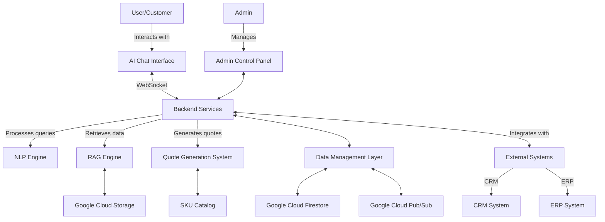
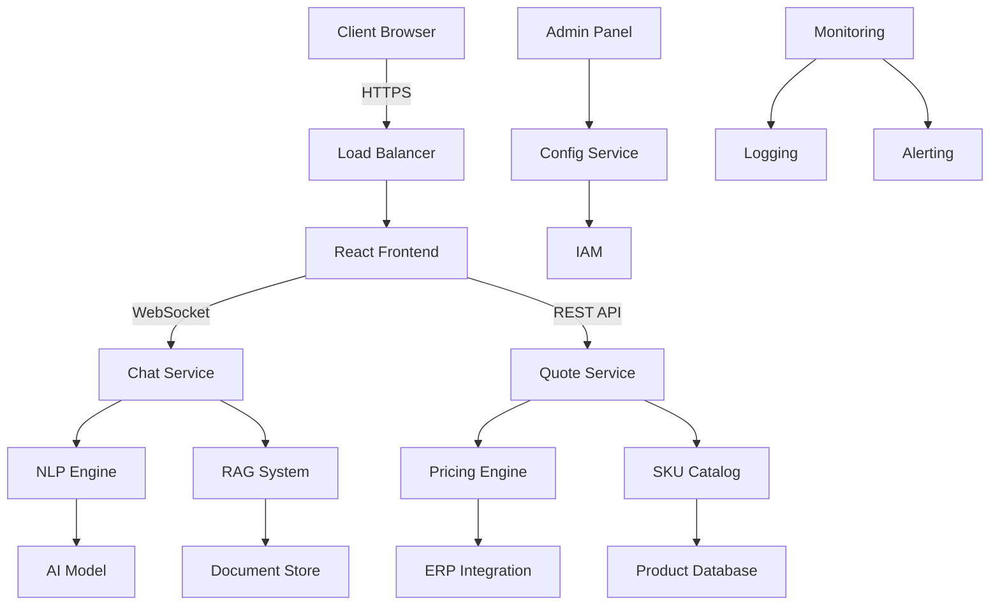
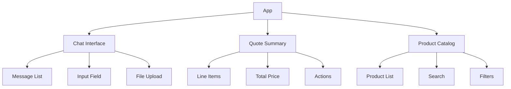
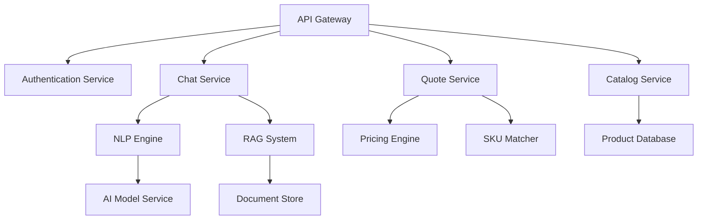
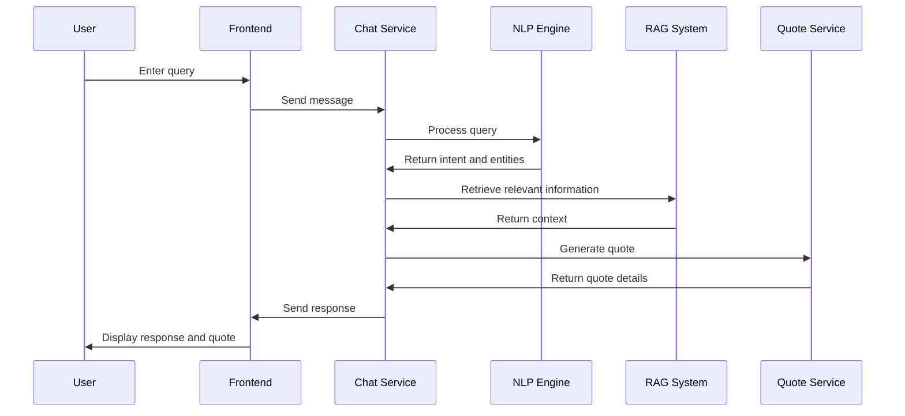
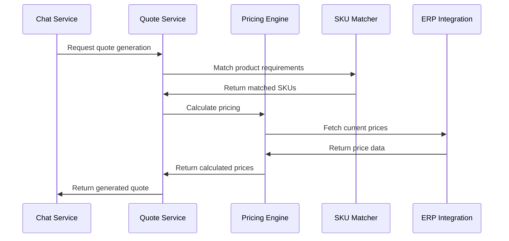
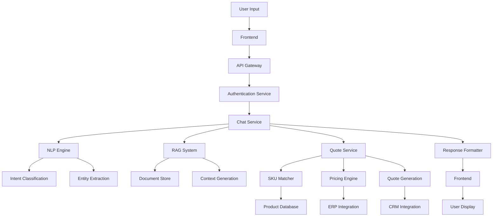
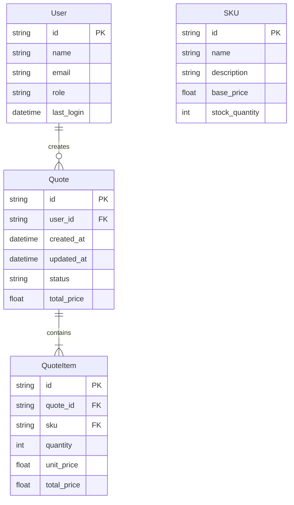
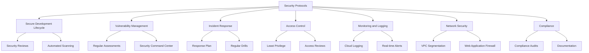

## SYSTEM OVERVIEW

The AI-powered salesperson chat system is a comprehensive solution designed to revolutionize the part quoting and ordering process for our client. This system leverages cutting-edge artificial intelligence technologies, cloud-based infrastructure, and seamless integrations to provide an efficient, accurate, and user-friendly experience for both sales representatives and customers.

### Key Components

1. **AI Chat Interface**
   - React-based frontend with Tailwind CSS for responsive design
   - WebSocket integration for real-time communication
   - Natural Language Processing (NLP) for understanding user queries

2. **Retrieval-Augmented Generation (RAG) Engine**
   - Python-based backend deployed on Google Cloud Functions
   - Integration with Google Cloud Storage for document retrieval
   - Custom machine learning models for context-aware information extraction

3. **Quote Generation System**
   - Python-based service for dynamic quote calculation
   - Integration with SKU catalog and pricing engine
   - Support for multi-part quotes and bulk order discounts

4. **Data Management Layer**
   - Google Cloud Firestore for real-time data storage
   - Google Cloud Storage for file management (e.g., technical drawings, product images)
   - Google Cloud Pub/Sub for real-time data synchronization

5. **Integration Services**
   - RESTful APIs for CRM and ERP system integration
   - OAuth 2.0 for secure authentication with external systems
   - Google Cloud Functions for serverless API implementations

6. **Admin Control Panel**
   - React-based dashboard for system configuration and monitoring
   - Role-based access control using Google Cloud IAM
   - Real-time analytics and reporting capabilities

### System Architecture



### Key Features

1. **Natural Language Understanding**
   - Advanced NLP capabilities for interpreting complex part requirements
   - Context-aware conversation flow for gathering missing information

2. **Intelligent Data Retrieval**
   - RAG system for pulling relevant data from internal documents and past quotes
   - Real-time integration with SKU catalog and pricing information

3. **Dynamic Quote Generation**
   - Support for complex pricing rules and bulk order discounts
   - Multi-part quote consolidation

4. **Seamless Integration**
   - Real-time synchronization with CRM and ERP systems
   - Automated update of customer records and order history

5. **Scalable Cloud Infrastructure**
   - Leveraging Google Cloud Platform for high availability and performance
   - Serverless architecture for cost-effective scaling

6. **Security and Compliance**
   - End-to-end encryption for data transmission
   - Compliance with GDPR, CCPA, and industry-specific regulations

7. **User-Friendly Interfaces**
   - Responsive design for both desktop and mobile access
   - Intuitive admin panel for system configuration and monitoring

### Technology Stack

| Component | Technology |
|-----------|------------|
| Frontend | React, Tailwind CSS, TypeScript |
| Backend | Python, Flask |
| Database | Google Cloud Firestore |
| File Storage | Google Cloud Storage |
| Serverless Functions | Google Cloud Functions |
| Message Queue | Google Cloud Pub/Sub |
| AI/ML | TensorFlow, Google Cloud AI Platform |
| Authentication | OAuth 2.0, Google Cloud IAM |
| API Gateway | Google Cloud API Gateway |

This AI-powered salesperson chat system represents a significant advancement in automating and optimizing the part quoting and ordering process. By combining state-of-the-art AI technologies with robust cloud infrastructure, the system promises to enhance efficiency, accuracy, and customer satisfaction while providing valuable insights for business growth.

## SYSTEM ARCHITECTURE

### PROGRAMMING LANGUAGES

The AI-powered salesperson chat system will utilize the following programming languages:

1. TypeScript
   - Used for: Frontend development (React components)
   - Justification: Provides strong typing and enhanced tooling support for large-scale React applications, improving code quality and maintainability.

2. Python
   - Used for: Backend services, AI/ML components, data processing
   - Justification: Extensive libraries for AI/ML (TensorFlow, scikit-learn), excellent support for data processing, and seamless integration with Google Cloud services.

3. SQL
   - Used for: Database queries and data manipulation
   - Justification: Standard language for relational database operations, used in conjunction with Google Cloud SQL.

4. Go
   - Used for: High-performance microservices
   - Justification: Excellent concurrency support and fast execution for critical backend services.

### HIGH-LEVEL ARCHITECTURE DIAGRAM

The following diagram provides an overview of the system's components and their interactions:



### COMPONENT DIAGRAMS

1. Frontend Components



2. Backend Services



### SEQUENCE DIAGRAMS

1. User Interaction Flow



2. Quote Generation Process



### DATA-FLOW DIAGRAM

The following diagram illustrates how information moves through the AI-powered salesperson chat system:



In this data flow:

1. User input is received through the frontend interface.
2. The input is sent to the backend services via the API Gateway.
3. The Chat Service processes the input using the NLP Engine for intent classification and entity extraction.
4. The RAG System retrieves relevant context from the Document Store.
5. The Quote Service matches SKUs, calculates pricing, and generates a quote.
6. The generated response and quote are formatted and sent back to the frontend for display to the user.

This architecture ensures a smooth flow of information from user input to intelligent response generation, leveraging various components to provide accurate and context-aware quotes.

## SYSTEM DESIGN

### PROGRAMMING LANGUAGES

The AI-powered salesperson chat system will utilize the following programming languages:

1. TypeScript
   - Used for: Frontend development (React components)
   - Justification: Provides strong typing and enhanced tooling support for large-scale React applications, improving code quality and maintainability.

2. Python
   - Used for: Backend services, AI/ML components, data processing
   - Justification: Extensive libraries for AI/ML (TensorFlow, scikit-learn), excellent support for data processing, and seamless integration with Google Cloud services.

3. SQL
   - Used for: Database queries and data manipulation
   - Justification: Standard language for relational database operations, used in conjunction with Google Cloud SQL.

4. Go
   - Used for: High-performance microservices
   - Justification: Excellent concurrency support and fast execution for critical backend services.

### DATABASE DESIGN

The system will use a combination of relational and NoSQL databases to handle different types of data efficiently.

1. Google Cloud SQL (PostgreSQL)
   - Used for: Structured data (user profiles, quotes, SKU catalog)
   - Schema:



2. Google Cloud Firestore
   - Used for: Semi-structured data (chat sessions, messages)
   - Collections:

```
- chat_sessions
  - id: string
  - user_id: string
  - customer_id: string
  - start_time: timestamp
  - end_time: timestamp
  - messages: subcollection
    - id: string
    - sender_type: string
    - content: string
    - timestamp: timestamp
```

3. Google Cloud Storage
   - Used for: Unstructured data (product images, technical drawings, documents)
   - Bucket structure:
     - product-images/
     - technical-drawings/
     - customer-documents/
     - generated-quotes/

### API DESIGN

The system will use RESTful APIs for communication between different components and external systems. The main API endpoints will include:

1. Chat API
   - POST /api/chat/start
   - POST /api/chat/message
   - GET /api/chat/{session_id}/history

2. Quote API
   - POST /api/quote/generate
   - GET /api/quote/{quote_id}
   - PUT /api/quote/{quote_id}/update

3. SKU API
   - GET /api/sku/search
   - GET /api/sku/{sku_id}

4. User API
   - POST /api/user/register
   - POST /api/user/login
   - GET /api/user/profile

Example API specification (OpenAPI 3.0):

```yaml
openapi: 3.0.0
info:
  title: AI Salesperson Chat System API
  version: 1.0.0
paths:
  /api/chat/start:
    post:
      summary: Start a new chat session
      responses:
        '200':
          description: Successful response
          content:
            application/json:    
              schema:
                type: object
                properties:
                  session_id:
                    type: string
  /api/chat/message:
    post:
      summary: Send a message in a chat session
      requestBody:
        required: true
        content:
          application/json:
            schema:
              type: object
              properties:
                session_id:
                  type: string
                message:
                  type: string
      responses:
        '200':
          description: Successful response
          content:
            application/json:
              schema:
                type: object
                properties:
                  response:
                    type: string
```

### USER INTERFACE DESIGN

The user interface will be developed using React and Tailwind CSS, focusing on responsiveness and intuitive design. The main components will include:

1. Chat Interface
   - Layout: Two-column design with chat window and quote summary
   - Key components:
     - Message list
     - Input field with file upload
     - Typing indicator
     - Quote summary panel (collapsible on mobile)

```typescript
// Example React component for chat interface
import React, { useState } from 'react';

const ChatInterface: React.FC = () => {
  const [message, setMessage] = useState('');

  const handleSend = () => {
    // Logic to send message
  };

  return (
    <div className="flex flex-col md:flex-row h-screen">
      <div className="flex-1 p-4 overflow-y-auto">
        {/* Message list */}
        <div className="space-y-4">
          {/* Render messages here */}
        </div>
      </div>
      <div className="w-full md:w-1/3 p-4 bg-gray-100">
        {/* Quote summary panel */}
        <h2 className="text-xl font-bold mb-4">Quote Summary</h2>
        {/* Render quote details here */}
      </div>
      <div className="absolute bottom-0 left-0 right-0 p-4 bg-white">
        <div className="flex items-center">
          <input
            type="text"
            className="flex-1 border rounded-l px-4 py-2"
            value={message}
            onChange={(e) => setMessage(e.target.value)}
            placeholder="Type your message..."
          />
          <button
            className="bg-blue-500 text-white px-4 py-2 rounded-r"
            onClick={handleSend}
          >
            Send
          </button>
        </div>
      </div>
    </div>
  );
};

export default ChatInterface;
```

2. Admin Dashboard
   - Layout: Sidebar navigation with main content area
   - Key components:
     - User management
     - SKU catalog management
     - Quote history and analytics
     - System configuration

```typescript
// Example React component for admin dashboard
import React from 'react';

const AdminDashboard: React.FC = () => {
  return (
    <div className="flex h-screen bg-gray-100">
      <div className="w-64 bg-white shadow-md">
        {/* Sidebar navigation */}
        <nav className="mt-5">
          <a href="#" className="block py-2 px-4 text-gray-700 hover:bg-gray-200">User Management</a>
          <a href="#" className="block py-2 px-4 text-gray-700 hover:bg-gray-200">SKU Catalog</a>
          <a href="#" className="block py-2 px-4 text-gray-700 hover:bg-gray-200">Quote History</a>
          <a href="#" className="block py-2 px-4 text-gray-700 hover:bg-gray-200">System Config</a>
        </nav>
      </div>
      <div className="flex-1 p-10">
        <h1 className="text-2xl font-bold mb-5">Admin Dashboard</h1>
        {/* Main content area */}
        <div className="bg-white rounded-lg shadow-md p-6">
          {/* Render dashboard content here */}
        </div>
      </div>
    </div>
  );
};

export default AdminDashboard;
```

These designs ensure a clean, modern, and responsive user interface that aligns with the system's requirements for both the chat interface and admin dashboard. The use of Tailwind CSS allows for rapid development and easy customization of the UI components.

## TECHNOLOGY STACK

### PROGRAMMING LANGUAGES

| Language   | Usage                                  | Justification                                                                                                   |
|------------|----------------------------------------|----------------------------------------------------------------------------------------------------------------|
| TypeScript | Frontend development                   | Provides strong typing and enhanced tooling support for large-scale React applications, improving code quality |
| Python     | Backend services, AI/ML components     | Extensive libraries for AI/ML, excellent support for data processing, and seamless integration with GCP        |
| SQL        | Database queries and data manipulation | Standard language for relational database operations, used in conjunction with Google Cloud SQL                |
| Go         | High-performance microservices         | Excellent concurrency support and fast execution for critical backend services                                 |

### FRAMEWORKS AND LIBRARIES

| Framework/Library | Purpose                                   | Justification                                                                        |
|-------------------|-------------------------------------------|--------------------------------------------------------------------------------------|
| React             | Frontend UI development                   | Efficient component-based architecture, large ecosystem, and excellent performance   |
| Tailwind CSS      | UI styling                                | Utility-first approach for rapid development and easy customization                  |
| Flask             | Backend API framework                     | Lightweight, flexible, and easy to integrate with Google Cloud Functions             |
| TensorFlow        | Machine learning and AI model development | Comprehensive ecosystem for building and deploying ML models, with GCP integration   |
| gRPC              | High-performance RPC framework            | Efficient binary communication protocol for microservices architecture               |
| Redux             | State management for React                | Predictable state container for complex React applications                           |
| Pandas            | Data manipulation and analysis            | Powerful data structures and tools for working with structured data in Python        |
| NumPy             | Numerical computing                       | Fundamental package for scientific computing in Python                               |
| scikit-learn      | Machine learning algorithms               | Comprehensive library for classical ML algorithms, used for preprocessing and models |

### DATABASES

| Database                  | Purpose                                     | Justification                                                                    |
|---------------------------|---------------------------------------------|----------------------------------------------------------------------------------|
| Google Cloud Firestore    | Primary NoSQL database                      | Scalable, real-time database with strong consistency and offline support         |
| Google Cloud SQL          | Relational database for structured data     | Fully managed relational database service, compatible with PostgreSQL            |
| Google Cloud Memorystore  | In-memory data store                        | Low-latency caching solution for frequently accessed data                        |
| Google Cloud Storage      | Object storage for large files and backups  | Scalable and durable object storage for unstructured data and backups            |

### THIRD-PARTY SERVICES

| Service                        | Purpose                                     | Justification                                                                 |
|--------------------------------|---------------------------------------------|-------------------------------------------------------------------------------|
| Google Cloud Natural Language  | NLP processing                              | Pre-trained models for intent classification and entity extraction            |
| Google Cloud Translation       | Multi-language support                      | Accurate and scalable translation service for global deployment               |
| Google Cloud Vision            | Image analysis for uploaded documents       | Extract text and analyze images from technical drawings and product images    |
| SendGrid                       | Email delivery service                      | Reliable email delivery for sending quotes and notifications                  |
| Stripe                         | Payment processing                          | Secure and compliant payment gateway for handling transactions                |
| Twilio                         | SMS notifications                           | Programmable SMS service for sending alerts and notifications to users        |
| Google Maps Platform           | Geolocation and mapping services            | Integrate location-based features and shipping distance calculations          |
| Google Cloud Security Command Center | Security monitoring and management    | Centralized security and risk management platform for GCP resources           |

### TECHNOLOGY STACK DIAGRAM

```mermaid
graph TD
    A[Frontend] --> B[React]
    A --> C[TypeScript]
    A --> D[Tailwind CSS]
    A --> E[Redux]
    F[Backend] --> G[Python]
    F --> H[Flask]
    F --> I[Go Microservices]
    J[Databases] --> K[Google Cloud Firestore]
    J --> L[Google Cloud SQL]
    J --> M[Google Cloud Memorystore]
    J --> N[Google Cloud Storage]
    O[AI/ML] --> P[TensorFlow]
    O --> Q[scikit-learn]
    O --> R[Pandas]
    O --> S[NumPy]
    T[Third-Party Services] --> U[Google Cloud Natural Language]
    T --> V[Google Cloud Translation]
    T --> W[Google Cloud Vision]
    T --> X[SendGrid]
    T --> Y[Stripe]
    T --> Z[Twilio]
    T --> AA[Google Maps Platform]
    T --> AB[Google Cloud Security Command Center]
```



This technology stack leverages the power of modern web technologies, cloud-native services, and robust AI/ML frameworks to build a scalable, efficient, and intelligent AI-powered salesperson chat system. The combination of TypeScript and React for the frontend, Python for the backend, and Google Cloud Platform services ensures a high-performance, secure, and easily maintainable system architecture.

## SECURITY CONSIDERATIONS

### AUTHENTICATION AND AUTHORIZATION

The AI-powered salesperson chat system will implement a robust authentication and authorization mechanism to ensure secure access and appropriate permissions for different user roles.

1. Authentication:
   - OAuth 2.0 will be used as the primary authentication protocol, integrated with Google Cloud Identity Platform.
   - Multi-factor authentication (MFA) will be enforced for all admin accounts and optional for other users.
   - Password policies will enforce strong passwords with regular rotation requirements.

2. Authorization:
   - Role-Based Access Control (RBAC) will be implemented using Google Cloud Identity and Access Management (IAM).
   - The following roles will be defined:
     - Customer: Limited access to chat interface and own quotes
     - Sales Representative: Access to chat interface, quote generation, and customer data
     - Admin: Full access to all system features and configurations
     - System: Used for service-to-service communication

3. JWT (JSON Web Tokens):
   - JWTs will be used for maintaining user sessions and securing API requests.
   - Tokens will be short-lived (1 hour) with refresh token functionality for extended sessions.

4. API Security:
   - All API endpoints will require authentication using JWT.
   - Rate limiting will be implemented to prevent abuse and DDoS attacks.

```typescript
// Example of JWT authentication middleware in Express.js
import { expressjwt } from 'express-jwt';
import jwksRsa from 'jwks-rsa';

const checkJwt = expressjwt({
  secret: jwksRsa.expressJwtSecret({
    cache: true,
    rateLimit: true,
    jwksRequestsPerMinute: 5,
    jwksUri: `https://YOUR_DOMAIN/.well-known/jwks.json`
  }),
  audience: 'YOUR_API_IDENTIFIER',
  issuer: `https://YOUR_DOMAIN/`,
  algorithms: ['RS256']
});

app.use(checkJwt);
```

### DATA SECURITY

Protecting sensitive information is crucial for maintaining trust and compliance. The following measures will be implemented:

1. Encryption:
   - All data at rest will be encrypted using AES-256 encryption.
   - Google Cloud Key Management Service (KMS) will be used for key management.
   - All data in transit will be encrypted using TLS 1.3.

2. Data Classification:
   - A data classification system will be implemented to categorize data based on sensitivity.
   - Access controls and security measures will be applied based on data classification.

| Classification | Description | Example | Security Measures |
|----------------|-------------|---------|-------------------|
| Public | Non-sensitive information | Product catalogs | No special measures |
| Internal | Business data not for public | Sales reports | Encryption, access controls |
| Confidential | Sensitive business data | Customer lists | Strong encryption, strict access controls, audit logging |
| Restricted | Highly sensitive data | Payment information | Strongest encryption, multi-factor auth, data masking |

3. Data Masking:
   - Sensitive data will be masked in logs and non-production environments.
   - Implement data anonymization techniques for analytics and reporting.

4. Secure File Handling:
   - All file uploads will be scanned for malware using Google Cloud Security Scanner.
   - Implement strict file type and size restrictions.
   - Store files in Google Cloud Storage with appropriate access controls.

5. Database Security:
   - Use Google Cloud SQL with encrypted connections and automated backups.
   - Implement database-level access controls and auditing.
   - Regular security patching and updates for database systems.

```python
# Example of data masking in Python
import re

def mask_pii(text):
    # Mask email addresses
    text = re.sub(r'(\w{1})\w+@(\w+\.)', r'\1****@\2', text)
    # Mask phone numbers
    text = re.sub(r'(\d{3})\d{3}(\d{4})', r'\1-***-\2', text)
    return text

# Usage
masked_text = mask_pii("Contact: john.doe@example.com, 123-456-7890")
print(masked_text)
# Output: Contact: j****@example.com, 123-***-7890
```

### SECURITY PROTOCOLS

The following security protocols and procedures will be implemented to maintain system security:

1. Secure Development Lifecycle (SDL):
   - Implement security checks at each stage of the development process.
   - Regular code reviews with a focus on security vulnerabilities.
   - Automated security scanning integrated into the CI/CD pipeline.

2. Vulnerability Management:
   - Regular vulnerability assessments and penetration testing.
   - Use of Google Cloud Security Command Center for centralized security management.
   - Implement a responsible disclosure program for external security researchers.

3. Incident Response Plan:
   - Develop and maintain a comprehensive incident response plan.
   - Regular drills and simulations to test the incident response process.
   - Integration with Google Cloud's security incident management tools.

4. Access Control:
   - Implement the principle of least privilege for all system access.
   - Regular access reviews and prompt revocation of unnecessary privileges.
   - Use of short-lived credentials and just-in-time access for sensitive operations.

5. Monitoring and Logging:
   - Implement comprehensive logging using Google Cloud Logging.
   - Set up real-time alerts for suspicious activities.
   - Retain logs for at least one year for audit and investigation purposes.

6. Network Security:
   - Implement network segmentation using Google Cloud VPC.
   - Use of Web Application Firewall (WAF) for protecting web applications.
   - Regular network penetration testing and vulnerability scanning.

7. Compliance:
   - Ensure compliance with relevant standards (e.g., SOC 2, PCI-DSS if handling payment data).
   - Regular compliance audits and assessments.
   - Maintain up-to-date documentation of security controls and procedures.



By implementing these comprehensive security measures across authentication, data security, and security protocols, the AI-powered salesperson chat system will maintain a strong security posture, protecting sensitive data and ensuring the trust of its users and stakeholders.